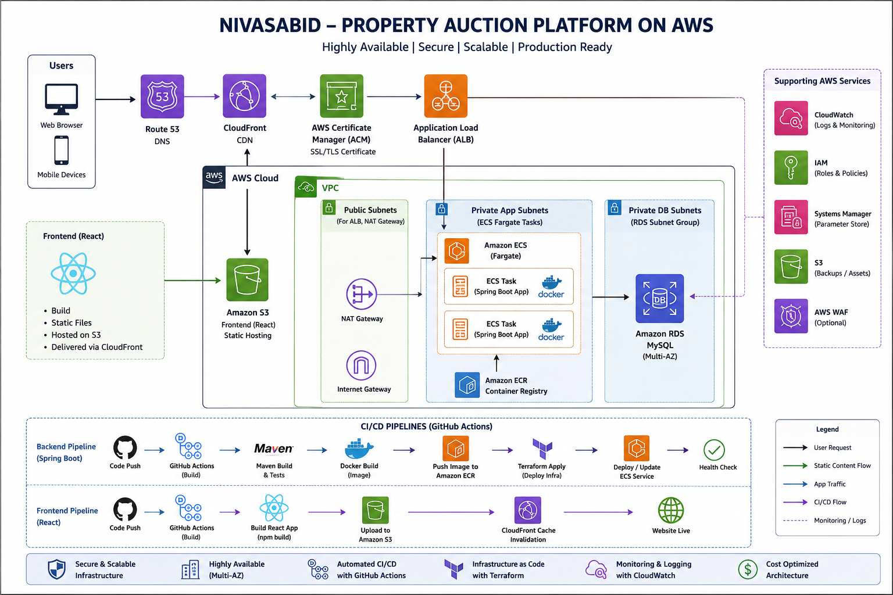

# 🏗️ Architecture Overview

## Introduction

Nivasabid is a cloud-native Property Auction Platform designed using Amazon Web Services (AWS) with a strong focus on scalability, high availability, security, and automation.

The infrastructure is provisioned using **Terraform (Infrastructure as Code)** and the applications are deployed through **GitHub Actions CI/CD pipelines**.

The platform consists of:

- React Frontend
- Spring Boot Backend
- Amazon RDS MySQL Database
- AWS Networking
- Containerized Deployment using ECS Fargate
- Global Content Delivery through CloudFront

---

# Architecture Goals

The infrastructure was designed with the following objectives:

- High Availability
- Scalability
- Security
- Infrastructure as Code
- Automated CI/CD
- Cost Optimization
- Easy Maintenance

---

# High-Level Architecture

<p align="center">
    
</p>

---

# Architecture Flow

The following sequence describes how a user request is processed.

```
User
   │
Internet
   │
Route53
   │
CloudFront
   │
──────────────────────────────
│                            │
│                            │
React Frontend               API Requests
(S3)                         │
                             │
                       Application Load Balancer
                             │
                      Amazon ECS Fargate
                             │
                      Spring Boot API
                             │
                      Amazon RDS MySQL
```

---

# Application Components

The application consists of two major components.

## Frontend

Technology:

- React
- Vite

Deployment:

- Static files hosted in Amazon S3
- Delivered globally through CloudFront

Responsibilities

- Property Listings
- User Authentication
- Property Search
- Auction Dashboard
- User Interface

---

## Backend

Technology

- Java Spring Boot

Deployment

- Docker Container
- Amazon ECS Fargate

Responsibilities

- Business Logic
- REST APIs
- Authentication
- Database Access
- Auction Processing

---

## Database

Technology

Amazon RDS MySQL

Responsibilities

- User Information
- Property Details
- Auction Data
- Transaction Records

---

# AWS Services Used

| Service | Purpose |
|----------|---------|
| Amazon VPC | Network Isolation |
| Public Subnets | ALB and NAT Gateway |
| Private App Subnets | ECS Tasks |
| Private DB Subnets | Amazon RDS |
| Internet Gateway | Internet Access |
| NAT Gateway | Outbound Internet Access |
| Application Load Balancer | Load Balancing |
| Amazon ECS Fargate | Container Hosting |
| Amazon ECR | Docker Image Registry |
| Amazon S3 | React Static Hosting |
| Amazon CloudFront | CDN |
| Amazon RDS | Database |
| AWS ACM | SSL Certificates |
| Route53 | DNS |
| IAM | Roles & Permissions |
| CloudWatch | Monitoring & Logs |

---

# Request Flow

## Frontend Request

```
User

↓

Route53

↓

CloudFront

↓

Amazon S3

↓

React Application
```

CloudFront caches static assets close to end users, reducing latency and improving performance.

---

## Backend Request

```
React Application

↓

Application Load Balancer

↓

Amazon ECS Fargate

↓

Spring Boot Application

↓

Amazon RDS MySQL
```

The Application Load Balancer distributes incoming API requests across ECS tasks.

---

# Networking Architecture

The infrastructure is deployed inside a dedicated Amazon VPC.

The VPC contains:

- Public Subnets
- Private Application Subnets
- Private Database Subnets

### Public Subnets

Used for

- Application Load Balancer
- NAT Gateway

### Private Application Subnets

Used for

- ECS Fargate Tasks

No direct internet access is allowed.

### Private Database Subnets

Used for

- Amazon RDS

The database is isolated from the internet and can only be accessed by the backend application.

---

# Why Amazon ECS Fargate?

The backend application runs on Amazon ECS Fargate because it provides:

- Serverless container hosting
- No EC2 instance management
- Automatic scaling
- High availability
- Reduced operational overhead

---

# Why Amazon CloudFront?

CloudFront improves application performance by:

- Caching static assets globally
- Reducing latency
- Improving user experience
- Supporting HTTPS
- Integrating with AWS Certificate Manager

---

# Why Amazon S3?

Amazon S3 is used because:

- Highly durable object storage
- Cost-effective
- Static website hosting
- Seamless integration with CloudFront

---

# Why Application Load Balancer?

The ALB provides:

- Layer 7 routing
- HTTPS termination
- Health checks
- Load distribution
- Integration with ECS

---

# Why Amazon RDS?

Amazon RDS provides:

- Managed database service
- Automated backups
- Multi-AZ deployment
- Automated patching
- High availability

---

# Why Terraform?

Terraform enables:

- Infrastructure as Code
- Version-controlled infrastructure
- Reusable modules
- Consistent deployments
- Easy environment provisioning

---

# Why GitHub Actions?

GitHub Actions provides:

- Automated CI/CD
- Docker image builds
- Deployment automation
- Infrastructure provisioning
- Continuous delivery

---

# Security Design

The platform follows several security best practices.

- Private application subnets
- Private database subnets
- IAM Roles with least privilege
- HTTPS using AWS Certificate Manager
- Security Groups restricting network traffic
- CloudFront secure content delivery
- No direct database exposure

---

# High Availability

The architecture is designed for high availability through:

- Multi-AZ deployment
- Application Load Balancer
- ECS Fargate Service
- CloudFront global edge locations
- Amazon RDS Multi-AZ

---

# Infrastructure as Code

All AWS resources are managed using Terraform modules.

The infrastructure includes modules for:

- VPC
- Security Groups
- IAM
- ACM
- ALB
- ECS
- ECR
- RDS
- S3
- CloudFront

This modular approach improves maintainability and allows infrastructure to be reused across environments.

---

# Deployment Workflow

Backend Deployment

```
Developer

↓

Git Push

↓

GitHub Actions

↓

Maven Build

↓

Docker Build

↓

Push Image to Amazon ECR

↓

Terraform Apply

↓

Deploy to Amazon ECS
```

Frontend Deployment

```
Developer

↓

Git Push

↓

GitHub Actions

↓

Build React Application

↓

Upload to Amazon S3

↓

CloudFront Cache Invalidation
```

---

# Future Enhancements

Potential future improvements include:

- AWS WAF
- Auto Scaling Policies
- Blue-Green Deployments
- AWS Secrets Manager Rotation
- Prometheus & Grafana Monitoring
- Disaster Recovery Automation
- AWS X-Ray Distributed Tracing

---

# Conclusion

The Nivasabid platform demonstrates a production-oriented AWS architecture built using Infrastructure as Code and modern DevOps practices.

The design emphasizes scalability, security, automation, and maintainability while providing a reliable foundation for deploying and operating a cloud-native property auction application.